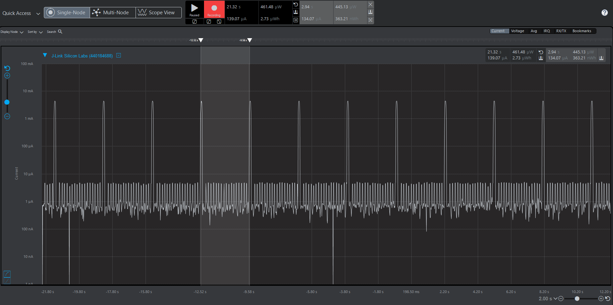
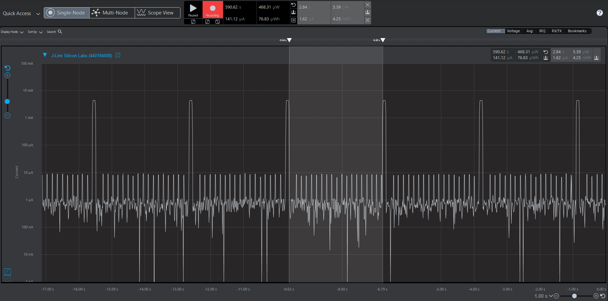
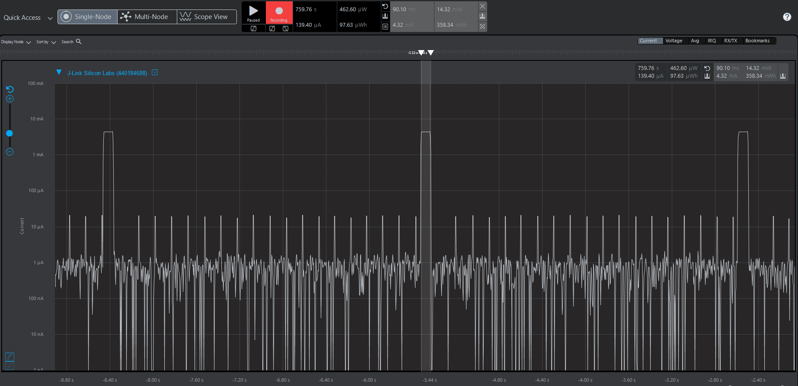

# Si7021 and Load Power Management (Assignment 3) 

## Running the tests
Lowest energy mode allowed for these tests  is EM3 during sleep. It is configurable through main.h file.

## Answers :
### 1) What is the average current per period?

    134.07 uA

 ### 2) What is the average current when the Si7021 is Off? 

	1.62 uA

 ### 3) What is the average current when the Si7021 is On?

	4.32 mA

### 4) How long is the Si7021 on for 1 temperature reading?

	90.10 ms

