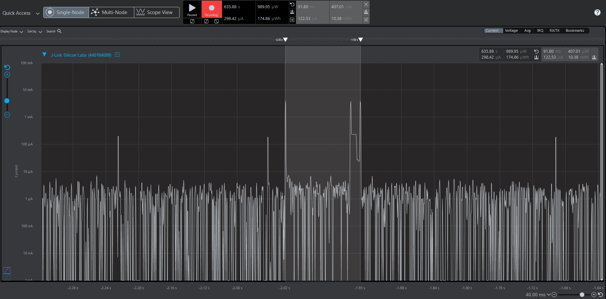
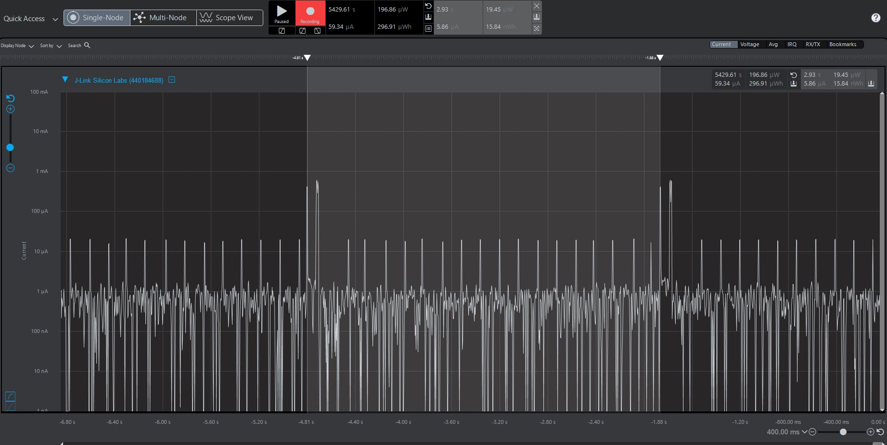

Please include your answers to the questions below with your submission, entering into the space below each question
See [Mastering Markdown](https://guides.github.com/features/mastering-markdown/) for github markdown formatting if desired.

*Be sure to take measurements in the "Default" configuration of the profiler to ensure your logging logic is not impacting current/time measurements.*

*Please include screenshots of the profiler window detailing each current measurement captured.  See [Shared document](https://docs.google.com/document/d/1Ro9G2Nsr_ZXDhBYJ6YyF9CPivb--6UjhHRmVhDGySag/edit?usp=sharing) for instructions.* 

1. What is the average current per period?
   Answer: 5.67 uA
    Screenshot:  
   

2. What is the average current when the Si7021 is Powered Off?
   Answer: 1.55 uA
    Screenshot:  
     

3. What is the average current when the Si7021 is Powered On?
   Answer: 127.29 uA
    Screenshot:  
     

4. How long is the Si7021 Powered On for 1 temperature reading?
   Answer: 91.80 ms
    Screenshot:  
   

5. Compute what the total operating time of your design for assignment 4 would be in hours, assuming a 1000mAh battery power supply?
   
   Answer: Though sample period is 3 seconds, in practice we get period of around 2.94 seconds for Lower energy mode.

      mAh for 1 hr = (number Of conversions in 1 hr) x conversion time(msec) x (conversion current per reading (mA) / (1000msec/sec x 3600 sec/hour)
      = (3600 / 2.94) * 2940 * (0.00567/3600000)
		= 1224 * 2940 * (0.00567/3600000)
		= 0.005667732

		Hours = Total battey capacity(mAh) / consumption per hour(mAh)
            = 176437.4180

      Total operating time would be around 176437 hours
      
   *Reference : AN607 - Si70XX HUMIDITY AND TEMPERATURE SENSOR DESIGNER ΓÇÖS GUIDE.pdf*

1. How has the power consumption performance of your design changed since the previous assignment?
   Answer:

      	Average current per reading or per period was 134.07 uA in I2C blocking mode. Whereas, it is 5.67 uA for non blocking mode.
         That is around 24 times (23.64 to be precise) less power consumption.
         With above calculation Temperature read in I2C blocking mode gives operating hours of  7466 much less as compared to 176437 hours in non blocking mode.

   
2. Describe how you have tested your code to ensure you are sleeping in EM1 mode during I2C transfers.
   Answer:
         	Two methods:

   	1) **With reference to EM0**
            
            I2C operation is possible only in two energy modes EM0 and EM1. Here, current consumption is compared for both EM0 and EM1. It is observed that code with EM1 shows lower current consumpion. This proves that I2C code worked correctly in EM1 mode.

         With EM1 : current consumption per reading 5.67 uA

         
            With EM0 : current consumption per reading 5.86 uA
         
   
      2) **Using debug log for entered energy mode**
         Sequence of state machine matched with entered energy modes as below
         
         
         It can be seen that I2C operations are in EM1 mode
   	

