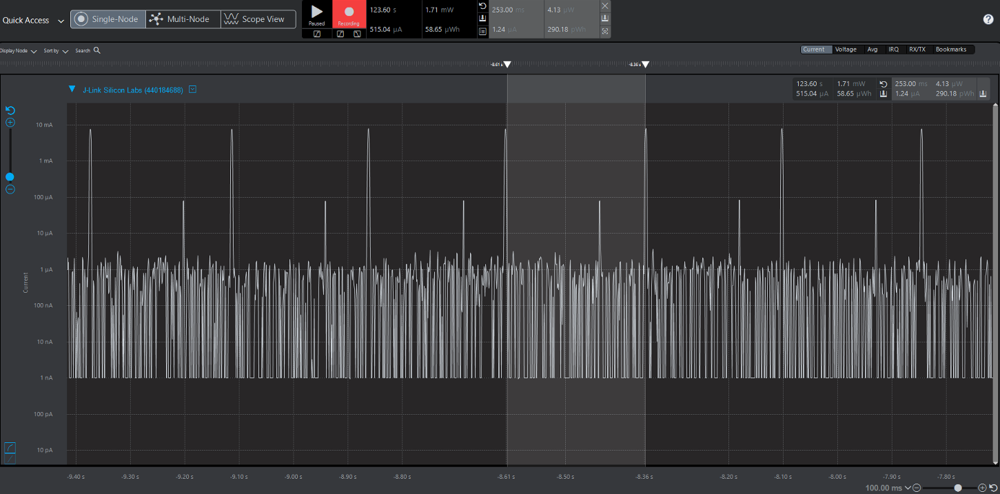

Please include your answers to the questions below with your submission, entering into the space below each question
See [Mastering Markdown](https://guides.github.com/features/mastering-markdown/) for github markdown formatting if desired.

*Be sure to take measurements in the "Default" configuration of the profiler to ensure your logging logic is not impacting current/time measurements.*

*Please include screenshots of the profiler window detailing each current measurement captured.  See [Shared document](https://docs.google.com/document/d/1Ro9G2Nsr_ZXDhBYJ6YyF9CPivb--6UjhHRmVhDGySag/edit?usp=sharing) for instructions.* 

1. Provide screen shot verifying the Advertising period matches the values required for the assignment.
   
   Expected : 250 ms
  
   

2. What is the average current between advertisements?
   Answer: 1.26uA
   
     

3. What is the peak current of an advertisement? 
   Answer: 9.79 mA
   
     

4. Provide screen shot showing the connection interval settings. Do they match the values you set in your slave(server) code or the master's(client) values?.
   
   These values were requested through slave
      
      Connection Interval Min and Max : 75ms (value = 60)

      latency : 300 ms => value ((300/75)-1) = 3

      Timeout: 900 ms (value 90)
   

     

5. What is the average current between connection intervals?
   

   Answer: 
  
   Connection interval of 75ms were not clear in waveform when slave latency set to 3.
   
   Approach 1: changing latency to 0.
   
      Current :  1.32 uA
   
       

   Approach 2: Averaging over 4 intervals
      
      Current : 2.09 uA
       

6. If possible, provide screen shot verifying the slave latency matches what was reported when you logged the values from event = gecko_evt_le_connection_parameters_id.
  
   Slave latency is 3 to support 300mS "Off the air" and period here is 300 ms.

   latency 0 corresponds to 1 connection interval(75 ms)
   => latency 3 corresponds to 4 connection interval(300 ms)
     

7. What is the peak current of a data transmission when the phone is connected and placed next to the Blue Gecko? 
   
   Answer: 10.49 mA
     
   
8. What is the peak current of a data transmission when the phone is connected and placed approximately 20 feet away from the Blue Gecko? 
   
   Answer: 17.35mA
     
   